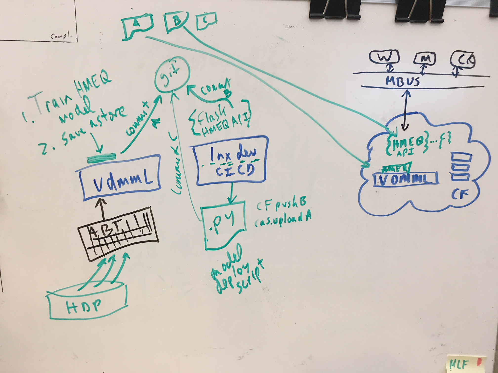

# SAS Viya Model Publishing Exploration

Using the Python for API for SAS Viya Data Mining and Machine Learning:
1. Train a Gradient Boosting model and save the model's state ('savestate') as the portable Analytic store formate (astore). 
2. Move the model's astore to another SAS Viya envionment and expose the model description, inputs, and outputs via REST API to allow for fast single record scoring against the saved model.

Roughly as in the following (this will be updated to reflect actual):


##Usage:
1. Run the GradBoost_savestate.ipynb notebook to train a Gradient Boosting machine and "savestate" the model as astore.
2. Run the model_publish_exploration.ipynb notebook for examples of dealing with the astore action and what the table looks like that it produces.
3. Run model_api.py to launch the flask app api.
4. Send single input records as json document to the model api.

##Usage example:
Run the model scoring api:
```
$ python model_api.py
```
Sample input request:
```
curl -u sasdemo:Orion123  -XPOST 'localhost:8989/score' -H 'Content-Type: application/json' -d'
[
{"BAD":1.0,"LOAN":1100.0,"MORTDUE":25860.0,"VALUE":39025.0,"REASON":"HomeImp","JOB":"Other","YOJ":10.5,"DEROG":0.0,"DELINQ":0.0,"CLAGE":94.3666666667,"NINQ":1.0,"CLNO":9.0,"DEBTINC":null,"im_CLAGE":94.3666666667,"im_DEBTINC":35.0,"im_DELINQ":0.0,"im_NINQ":1.0,"im_YOJ":10.5,"_PartInd_":1.0}
]
'
```
Sample output:
```
< 
[{"P_BAD1":0.3841294054,"P_BAD0":0.6158705946,"I_BAD":"           0","_WARN_":""}]
* Closing connection 0
```

Sample model_api.py log output:
```
...
 * Running on http://0.0.0.0:8989/ (Press CTRL+C to quit)
 * Restarting with stat
NOTE: Added action set 'astore'.
NOTE: Added action set 'decisiontree'.
CAS('bbviya3.pre-sal.sashq-r.openstack.sas.com', 5570, 'sasdemo', protocol='cas', name='brad', session='d46a7762-079a-bf49-b5fe-7f4d4fdba861')
[FileInfo]

    Permission Owner Group                         Name    Size Encryption  \
 0  -rw-r--r--   cas   sas      predef_svrtdist.sashdat   78872       NONE   
 1  -rwxr-xr-x   cas   cas      gb_model_astore.sashdat  372893       NONE   
 2  -rwxr-xr-x   cas   cas  gb_model_astore.bin.sashdat  381288       NONE   
 
                  Time  
 0  12Jan2017:19:24:38  
 1  11Dec2017:18:54:58  
 2  11Dec2017:19:36:10  

+ Elapsed: 0.0045s, user: 0.00226s, sys: 0.00224s, mem: 0.0857mb
NOTE: Cloud Analytic Services made the uploaded file available as table GB_MODEL_ASTORE in caslib public.
NOTE: The table GB_MODEL_ASTORE has been created in caslib public from binary data uploaded to Cloud Analytic Services.
 * Debugger is active!
 * Debugger PIN: 433-199-577
[{'BAD': 1.0, 'LOAN': 1100.0, 'MORTDUE': 25860.0, 'VALUE': 39025.0, 'REASON': 'HomeImp', 'JOB': 'Other', 'YOJ': 10.5, 'DEROG': 0.0, 'DELINQ': 0.0, 'CLAGE': 94.3666666667, 'NINQ': 1.0, 'CLNO': 9.0, 'DEBTINC': None, 'im_CLAGE': 94.3666666667, 'im_DEBTINC': 35.0, 'im_DELINQ': 0.0, 'im_NINQ': 1.0, 'im_YOJ': 10.5, '_PartInd_': 1.0}]
NOTE: Cloud Analytic Services made the uploaded file available as table INPUT in caslib public.
NOTE: The table INPUT has been created in caslib public from binary data uploaded to Cloud Analytic Services.
[{"Task":"Loading the Store","Seconds":0.0000071526,"Percent":0.0000336048},{"Task":"Creating the State","Seconds":0.0115249157,"Percent":0.0541474512},{"Task":"Scoring","Seconds":0.2013099194,"Percent":0.9458133431},{"Task":"Total","Seconds":0.2128431797,"Percent":1.0}]
[{"P_BAD1":0.4934179315,"P_BAD0":0.5065820685,"I_BAD":"           0","_WARN_":""}]
127.0.0.1 - - [12/Dec/2017 22:58:23] "POST /score HTTP/1.1" 200 -
```

##Requirements:
* SAS Viya Data Mining and Machine Learning
* Python-SWAT package for accessing SAS
* Python packages: Pandas, numpy, Flask, json
